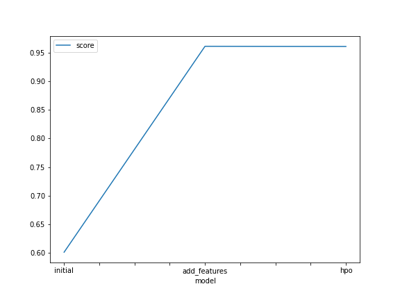
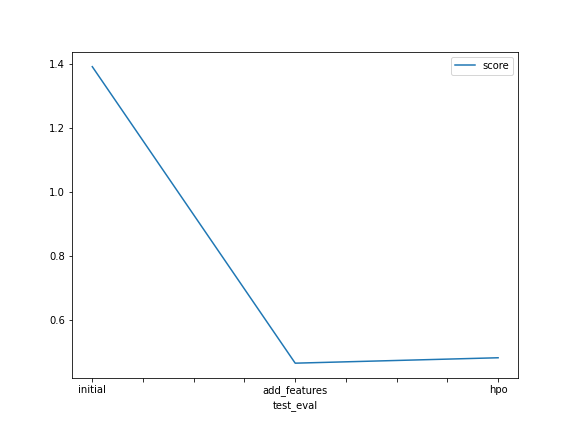

# Report: Predict Bike Sharing Demand with AutoGluon Solution
#### NAME HERE
Bill L

## Initial Training
### What did you realize when you tried to submit your predictions? What changes were needed to the output of the predictor to submit your results?
Values less than zero needed to be set to zero.

### What was the top ranked model that performed?
Here are the results for the initial training, showing model_best = WeightedEnsemble_L3:
```
'model_performance': {'KNeighborsUnif_BAG_L1': 0.21572321954622853,
  'KNeighborsDist_BAG_L1': 0.12381434021469773,
  'LightGBMXT_BAG_L1': 0.4522208535196661,
  'LightGBM_BAG_L1': 0.4666187135763119,
  'RandomForestMSE_BAG_L1': 0.5723300056850734,
  'CatBoost_BAG_L1': 0.46612979906807883,
  'ExtraTreesMSE_BAG_L1': 0.494905549777618,
  'NeuralNetFastAI_BAG_L1': 0.42022293728874394,
  'XGBoost_BAG_L1': 0.4664618870563133,
  'NeuralNetMXNet_BAG_L1': 0.3945836791949905,
  'WeightedEnsemble_L2': 0.5727853199559477,
  'LightGBMXT_BAG_L2': 0.589200109650856,
  'LightGBM_BAG_L2': 0.5853143953354714,
  'RandomForestMSE_BAG_L2': 0.567887611609375,
  'CatBoost_BAG_L2': 0.5881293910039566,
  'ExtraTreesMSE_BAG_L2': 0.5774803284489658,
  'NeuralNetFastAI_BAG_L2': 0.5967720494789708,
  'XGBoost_BAG_L2': 0.5818018464271284,
  'NeuralNetMXNet_BAG_L2': 0.5670571461769954,
  'LightGBMLarge_BAG_L2': 0.4694346441325703,
  'WeightedEnsemble_L3': 0.6008439123016514},
 'model_best': 'WeightedEnsemble_L3',

'leaderboard':                      model  score_val  pred_time_val     fit_time  \
 0      WeightedEnsemble_L3   0.600844       8.842614  1120.090929
 1   NeuralNetFastAI_BAG_L2   0.596772       6.340614   887.205620
 2        LightGBMXT_BAG_L2   0.589200       6.227674   783.943817
 3          CatBoost_BAG_L2   0.588129       6.017367   794.591036
 4          LightGBM_BAG_L2   0.585314       6.054471   774.004874
 5           XGBoost_BAG_L2   0.581802       6.061736   778.330801
 6     ExtraTreesMSE_BAG_L2   0.577480       6.434174   767.665323
 7      WeightedEnsemble_L2   0.572785       1.946694   409.315392
 8   RandomForestMSE_BAG_L1   0.572330       0.378134     7.052367
 9   RandomForestMSE_BAG_L2   0.567888       6.446346   790.412196
 10   NeuralNetMXNet_BAG_L2   0.567057       7.594893   901.830042
 11    ExtraTreesMSE_BAG_L1   0.494906       0.392426     3.035621
 12    LightGBMLarge_BAG_L2   0.469435       6.027154   765.636912
 13         LightGBM_BAG_L1   0.466619       0.474954    33.758901
 14          XGBoost_BAG_L1   0.466462       0.146672    19.167186
 15         CatBoost_BAG_L1   0.466130       0.046252    61.212439
 16       LightGBMXT_BAG_L1   0.452221       2.490350   127.156010
 17  NeuralNetFastAI_BAG_L1   0.420223       0.276715   108.090169
 18   NeuralNetMXNet_BAG_L1   0.394584       1.567910   401.789879
 19   KNeighborsUnif_BAG_L1   0.215723       0.103322     0.031379
 20   KNeighborsDist_BAG_L1   0.123814       0.104763     0.025091
```
## Exploratory data analysis and feature creation
### What did the exploratory analysis find and how did you add additional features?
Some columns were missing from the test data, so needed to be ignored in the train data.
Split up the date field into year, month, day and hour.
Changed the type of the weather and season fields to category.

### How much better did your model preform after adding additional features and why do you think that is?
It improved (reduced) the score by a factor of almost 3.
I think this is because the models were able to train better.

## Hyper parameter tuning
### How much better did your model preform after trying different hyper parameters?
There was very little improvement over the defaults.  I stretched the time_limit out to 25 minutes for each of the hyperparameter runs, but they may have wanted a lot more.
### If you were given more time with this dataset, where do you think you would spend more time?
I would remove the time_limit parameter, to allow all model training to run to full completion.  I started with the recommended 10 minutes, and increased it to 15 minutes and then 20 minutes, but some models were still eventually timing out.

### Create a table with the models you ran, the hyperparameters modified, and the kaggle score.
|model|time_limit|auto_stack|num_bag_folds|num_bag_sets|num_stack_levels|score|
|--|--|--|--|--|--|--|
|initial|1200|||||1.39168|
|add_features|1200|||||0.46509|
|hpo1|1500|True||||0.48201|
|hpo2|1500|False|5.0||2.0|0.46276|
|hpo3|1500|False|9.0||3.0|0.46265|
### Create a line plot showing the top model score for the three (or more) training runs during the project.



### Create a line plot showing the top kaggle score for the three (or more) prediction submissions during the project.



## Summary
This was a good project for getting familiar with kaggle and AutoGluon.
Some time went into developing functions such as these:
```
def top_model_score(predictor):
    summary = predictor.fit_summary()
    model_performance = summary['model_performance']
    model_best = summary['model_best']
    return model_performance[model_best]

def get_kaggle_score( competition, filename, use_private=True ):
    # Expects filenames to be unique.
    # If kaggle user submits the same filename more than once for a competition,
    # then returns the first matching score it encounters.
    # Consider using filename_date() for filename construction.
    submissions = !kaggle competitions submissions -c {competition}
    for line in submissions[2:]:
        splits = line.split()
        if splits[0] == filename:
            if use_private:
                return float(splits[-1])
            else: # else gets public score
                return float(splits[-2])
```
and I used AWS Secrets Manager for kaggle credentials.
